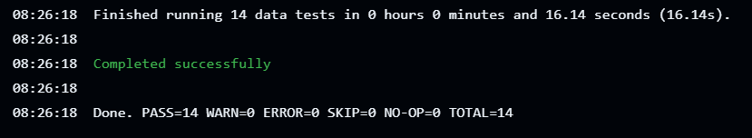
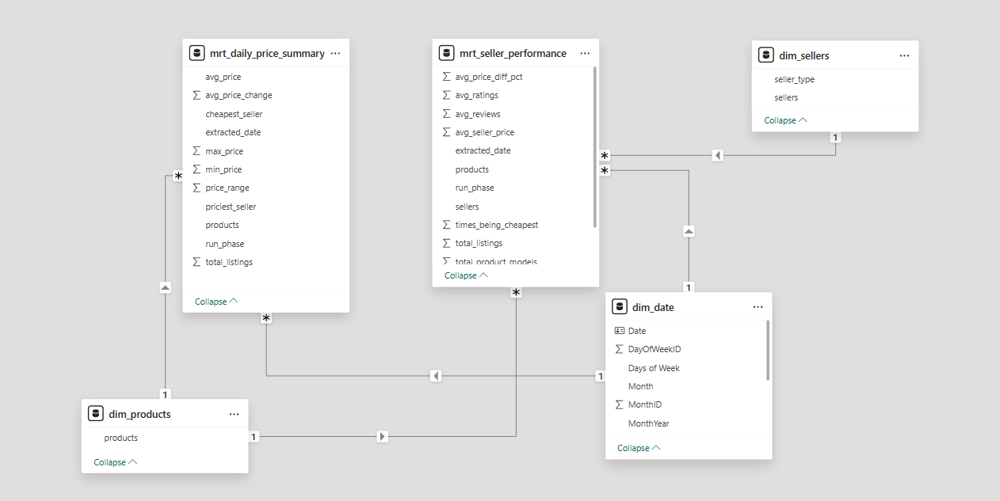
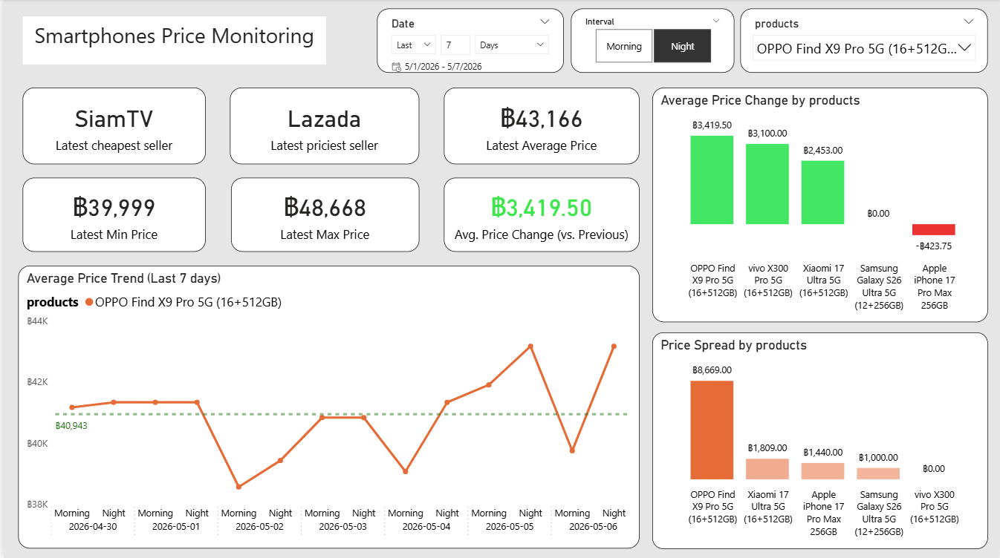
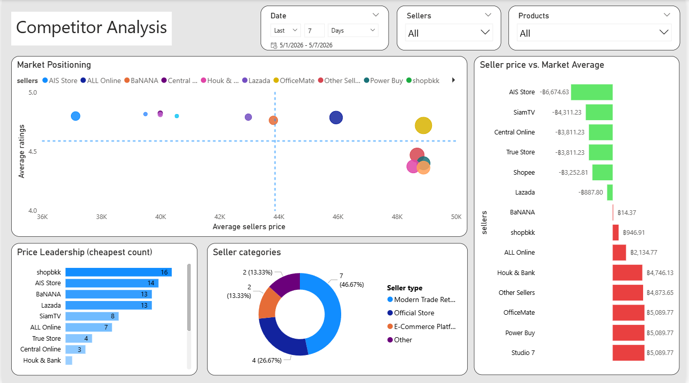
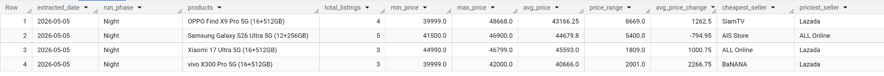

# End-to-End Data Engineering Project: Smartphones Price Monitoring

An automated end-to-end data pipeline designed to track and analyze smartphone pricing across multiple e-commerce platforms. This project leverages the **Modern Data Stack** to transform raw marketplace data into strategic pricing intelligence.


<p align="center">
  
  
  
  
  
  
  
  
</p>


## Table of Contents
* [Business Case](#business-case)
    * [Project Scope](#project-scope)
* [Pipeline Architecture](#pipeline-architecture)
    * [Tech Stacks](#tech-stacks)
    * [Data Pipeline Flow](#data-pipeline-flow)
    * [Source Code Map](#source-code-map)
	* [Data Quality & Continuous Integration (CI)](#data-quality--continuous-integration-ci)
    * [Data Modeling](#data-modeling)
* [Data Visualization](#data-visualization)
    * [Price Monitoring](#price-monitoring)
    * [Competitor Analysis](#competitor-analysis)
* [Challenges](#challenges)
* [Setup Instructions](#setup-instructions)


## Business Case 

In the aggressive smartphone retail market, pricing is a primary battlefield for market share. For stakeholders and marketing strategy teams, staying ahead of competitors requires more than just observation; it demands automated, daily, actionable intelligence. Stakeholders within the pricing and sales teams rely on this pipeline for:

- Optimizing competitive pricing strategies to stay relevant in the market.

- Analyzing market trends and forecasting future movements.

- Analyzing competitor behavior to identify price leaders, market influencers, and potential threats.

- Replacing manual price checking with a robust automated pipeline, allowing the team to focus on strategy rather than data collection.

### Project Scope

To demonstrate the pipeline's capability in handling high-frequency, real-world market data, the current scope is focused on the Ultra-Flagship segment of the smartphone market. The system tracks the following target products:

- **Apple:** iPhone 17 Pro Max

- **Samsung:** Samsung Galaxy S26 Ultra

- **Xiaomi:** Xiaomi 17 Ultra

- **OPPO:** OPPO Find X9 Pro

- **vivo:** vivo X300 Pro

*All selected models are base storage capacity.

**Data Source:** SerpApi

**Scalability:** The pipeline is architected to be product-agnostic. While currently configured for these 5 flagship models, the system can be easily scaled to track hundreds of different product categories by simply updating the target configuration.


## Pipeline Architecture


### Tech Stacks

- **Docker:** Used for containerizing the orchestration engine (Apache Airflow). This ensures a consistent environment for scheduling, monitoring, and triggering tasks across the pipeline without local dependency issues.

- **Apache Airflow:** The core orchestration engine used to schedule, automate, and monitor the end-to-end workflow, from data ingestion to the final transformation.

- **Google Cloud Storage (GCS):** Acts as the project's Data Lake, providing scalable object storage for landing and archiving raw data files before processing.

- **BigQuery:** A serverless, highly scalable cloud data warehouse used to store structured data and execute complex analytical queries at high speed.

- **dbt (Data Build Tool):** The transformation layer used to clean, model, and prepare data within BigQuery using SQL, implementing the **Medallion Architecture** (Raw, Staging, and Marts).

- **Power BI:** The visualization platform used to create interactive dashboards, turning processed data into actionable market insights.

### Data Pipeline Flow

- **Extract:** Automated data collection from SerpApi (Data Source) using Python scripts. These tasks are orchestrated by **Apache Airflow** and the extracted data is stored as raw files in **Google Cloud Storage (GCS)**.

- **Load:** Raw data files from GCS are transferred to **BigQuery** raw tables, serving as the landing zone for the data warehouse.

- **Transform:** Data is processed within BigQuery using **dbt**, following the Medallion Architecture to ensure data quality and integrity:

	- **Raw Data (Raw):** The initial ingestion layer where data is kept in its original format to maintain a source of truth.

	- **Cleaned Data (Staging):** Involves data cleaning, type casting, standardized naming conventions, and deduplication to create a reliable foundation.

	- **Business-level Data (Marts):** The final analytical layer where data is joined and aggregated. This includes complex logic, making it ready for **Power BI** visualization.

### Source Code Map

Below is a map of the core files and directories used in this project. Click the links to view the source code.

| Component | File Link (Source Code) | Description |
| :--- | :--- | :--- |
| **Orchestration** | [`smartphones_pipeline.py`](./dags/smartphones_pipeline.py) | The Airflow DAG that manages and schedules the daily data pipeline execution. |
| **Source Config (Raw)** | [`_sources.yml`](./dbt/dbt_transformation/models/raw/_sources.yml) | Defines the raw data sources. |
| **Data Cleaning (Staging)** | [`stg_smartphone_pricing.sql`](./dbt/dbt_transformation/models/staging/stg_smartphone_pricing.sql) | Standardizes raw scraped data, handles type casting, and prepares data for the Marts layer. |
| **Price Monitoring (Marts)** | [`mrt_daily_price_summary.sql`](./dbt/dbt_transformation/models/marts/mrt_daily_price_summary.sql) | Core SQL logic for calculating price shifts and run-over-run deltas for the monitoring dashboard. |
| **Competitor Analysis (Marts)** | [`mrt_seller_performance.sql`](./dbt/dbt_transformation/models/marts/mrt_seller_performance.sql) | Aggregates seller behavior, including price leadership counts and rating performance. |
| **Product Dimensions** | [`dim_products.sql`](./dbt/dbt_transformation/models/marts/dim_products.sql) | Contains unique smartphone models. |
| **Seller Dimensions** | [`dim_sellers.sql`](./dbt/dbt_transformation/models/marts/dim_sellers.sql) | Stores seller names and seller categories to support competitor analysis.. |
| **Data Quality (Staging)** | [`stg_test.yml`](./dbt/dbt_transformation/models/staging/stg_test.yml) | The main configuration file for the dbt project and resource paths. |
| **Data Quality (Marts)** | [`marts_test.yml`](./dbt/dbt_transformation/models/marts/marts_test.yml) | Defines schema tests (Not Null, Accepted Values) to ensure raw data integrity. |
| **CI Pipeline** | [`CI.yml`](./.github/workflows/CI.yml) | Automated GitHub Actions workflow that triggers dbt tests to ensure data quality on every push or PR. |
| **Project Config** | [`dbt_project.yml`](./dbt/dbt_transformation/dbt_project.yml) | Validates business logic (Unique keys) to prevent data duplication in the final reports.. |

### Data Quality & Continuous Integration (CI)

To ensure data reliability and maintain a **single source of truth**, I implemented automated data quality checks using **dbt tests** integrated into a **GitHub Actions CI pipeline**.

####  dbt Tests

- **Staging Layer:** Focuses on schema validation and basic cleaning rules before any business logic is applied.

	- **Not Null Tests:** Applied to critical columns such as `price`, `products`, and `extracted_date`to prevent missing data.

	- **Accepted Values:** Validates the `run_phase` column to ensure it contains only 'Morning' or 'Night', preventing ingestion errors.

- **Marts Layer:** Ensures the final analytical models conform to the Star Schema requirements.

	- **Unique Key Tests:** Verified that `dim_products` and `dim_sellers` contain zero duplicates.

	- **Data Consistency:** Enforced `not_null` constraints on primary keys and foreign keys across all Fact and Dimension tables.

#### Automated CI Workflow (GitHub Actions)

- **Automated Execution:** The workflow triggers on every `push` or `pull_request` to the main branch.

- **Quality Control:** Currently passing 14/14 tests, ensuring that no broken logic or dirty data reaches the production BigQuery environment.

	

- **Secure Integration:** Managed GCP credentials securely using GitHub Secrets to maintain environment integrity.


### Data Modeling

#### Star Schema

To ensure high performance and flexible analysis, I implemented a **Star Schema** model within Power BI. This structure separates business metrics (Facts) from descriptive attributes (Dimensions).



- **Fact Tables:** Core metrics are split into `mrt_daily_price_summary` for price monitoring and `mrt_seller_performance` for competitor analysis.

- **Dimension Tables:** `dim_products`, `dim_sellers`, and a custom `dim_date` provide context and filtering capabilities across all reports.

#### Custom Date Dimension 

I used **DAX** to create a custom `dim_date` table instead of relying on the default system calendar.This allows for advanced time-based analysis.

```M Language 
dim_date = 
	VAR startYear = YEAR(MIN(mrt_daily_price_summary[extracted_date]) ) 
	VAR endYear = YEAR(MAX(mrt_daily_price_summary[extracted_date]) )
	RETURN
	ADDCOLUMNS (
	CALENDAR(
	DATE(startYear,1,1),
	DATE(endYear,12,31)
	),
	"Year", YEAR([Date]),
    "Quater", "Q" & FORMAT([Date], "q"),
    "QuarterID", QUARTER([Date]),
	"Month", FORMAT([Date], "mmm"),
	"MonthID", MONTH([Date]),
	"MonthYear", FORMAT([Date], "mmm yyyy"),
	"MonthYearID", INT(FORMAT([Date], "yyyymm")), 
	"QuarterYear", "Q" & FORMAT([Date], "q yyyy"),
	"QuarterYearID", INT(FORMAT([Date], "yyyyq")),
    "Days of Week", FORMAT([Date], "ddd"),
    "DayOfWeekID", WEEKDAY([Date], 1)
	)
```
#### Measures

To drive deeper insights, I developed custom measures using **DAX** to handle dynamic benchmarking. A key example is the **Price Gap from Market Avg**, which powers the competitor benchmarking visualizations.

```M Language 
Price Gap from Market Avg = 
VAR MarketAvg = CALCULATE(
    AVERAGE(mrt_seller_performance[avg_seller_price]), 
    ALL(dim_sellers)
)
VAR SellerPrice = AVERAGE(mrt_seller_performance[avg_seller_price])

RETURN 
IF(
    NOT ISBLANK(SellerPrice),
    SellerPrice - MarketAvg
)
```

- **Logic:** This measure calculates the difference between an individual seller's price and the overall market average. 
- **Key Technique:** It uses the `ALL()` function to bypass specific seller filters, ensuring the market baseline remains constant for comparison.


## Data Visualization

Transforming raw scraped data into decision-ready insights. These dashboards eliminate the guesswork, turning market noise into the clear information needed to make strategic pricing moves.

### Price Monitoring



Instead of manually checking dozens of websites, this dashboard provides an automated way to track how smartphone prices move with every scheduled run. It’s designed to give the team a clear view of the market without the manual grind.

- **Benchmarking (KPI Cards):**

	- The cards at the top show the **Latest Min & Max prices** and   identify the **cheapest and priciest sellers**

	- This gives the team a reliable market floor and market ceiling to help decide if our own prices need an adjustment.

- **Price Trend (Line Chart):**

	- Tracks price movements between Morning and Night updates, providing a more granular view of how prices shift within the day the day.

	- The dashed line represents the 7-day average, serving as a baseline that helps the team instantly identify if the current price is above or below the weekly norm.

- **Average Price Change:**

	- This chart simply shows how much the average market price has increased or decreased compared to the very latest previous updated.

	- It helps the team quickly identify which phone models just had a price correction so they can react immediately.

- **Price Spread:**

	- This shows the **difference between the highest and lowest price** for each model.

	- A wide gap tells us that retailers are fighting hard on price for that specific model, signaling an opportunity for us to optimize our strategy and capture more customers.

#### Actionable Insight

**Case Study: OPPO Find X9 Pro 5G**

Taking the **OPPO Find X9 Pro 5G (16+512GB)** as an example, we can see exactly how the pricing team can turn these visualizations into action:

- **Insight:** The line chart reveals that the price is currently on a sharp uptrend, hitting an average of **฿43,166**, which is well above the 7-day baseline of **฿40,943**. More importantly, there is a massive Price Spread of **฿8,669**—the highest in the category—showing a huge gap between the cheapest seller **(SiamTV at ฿39,999)** and the priciest **(Lazada at ฿48,668)**.

- **Action:** With the market price currently **spiking (+฿3,419)**, the team should avoid aggressive price-cutting for now. Instead, we have a prime opportunity to position our price in the **"Sweet Spot"**—slightly above SiamTV but significantly lower than the market average. This allows us to capture value-seeking customers while maintaining a much healthier profit margin than our competitors.

### Competitor Analysis



This dashboard shifts the focus from specific products to competitor behavior. It helps the team understand who is truly leading the market in terms of both price and reputation.

- **Market Positioning (Bubble Chart):**

	- This compares **Average Seller Price** vs. **Average Ratings**, with the **bubble size representing the volume of reviews**, allowing us to spot **high-threat competitors**—sellers who offer low prices and high ratings with a large review count, proving they are both competitive and highly trusted.

	- The quadrant lines provide a quick way to see which sellers are positioned as **"Premium"** (high price, high rating) versus those competing purely on **"Value"** (low price, high rating).

- **Price Leadership (Cheapest Count):**

	- Instead of looking at a single price point, this chart tracks who consistently holds the **cheapest seller** across all listings.

	- It identifies the most aggressive players in the market, showing who is most likely to drive price changes.

- **Seller Price vs. Market Average:**

	- This chart identifies the **"price cutters"** (green bars) and **"premium sellers"** (red bars).

	- It shows exactly how much a specific seller is undercutting or overcharging compared to the market average, which is essential for adjusting our own pricing strategy.

- **Seller Categories:**

	- This breaks down the market landscape by **Seller Type** (e.g., Official Stores vs. E-Commerce Platforms).

	- It helps the strategy team understand whether the current market trends are being driven by official brand movements or third-party retailers.

#### Actionable Insight

**Case Study: AIS Store**

By analyzing **AIS Store**, we can identify the most aggressive player in the market and determine how to respond:

- **Insight:** AIS Store is currently our primary **"Price Leader."** In the Market Positioning chart, they sit in the high-trust, low-price quadrant with an average price of **฿37,135.60** and over **8,000 reviews**. They aren't just undercutting the market average by **฿6,674.63**; they are doing it with high reliability **(4.8 rating)**, making them a dominant threat.

- **Action:** Since it’s difficult to compete with AIS Store on price alone due to their scale, the team should use them as a **"Price Floor" benchmark**. Our strategy should be to monitor their stock levels closely—whenever AIS Store is "Out of Stock," it creates a golden window for us to increase our prices back toward the market average to maximize profit without losing customers to them.


## Challenges

During the production run of this pipeline (2026-04-24 to 2026-05-07), I monitored the data quality and identified a specific anomaly that provides insight into real-world data collection:



* **Incident:** On **2026-05-05 (Night Run)**, data for the **Apple iPhone 17 Pro Max was missing** from the dataset, while other products were ingested normally.

* **Observations:** The product returned to the dataset in the subsequent runs (2026-05-06 Morning/Night) without any changes to the scraper logic.

* **Root Cause Analysis:** This likely indicates a transient issue at the source, likely due to a temporary **unlisting** or **Out of Stock** status on the e-commerce platform during that specific scrape window.

* **Engineering Takeaway:** This case highlights the importance of Idempotency and Historical Monitoring. Because the pipeline is automated and runs twice daily, we can identify these gaps and ensure that a single missing data point doesn't break the entire analytical model, while still maintaining the integrity of the overall price trend.

## Setup Instructions

### 1. Prerequisites

Before you begin, ensure you have the following installed and configured on your local machine:

- **Docker & Docker Compose:** To run the containerized environment.

- **Git:** For version control and cloning the repository.

- **Google Cloud Platform Account:** Required for GCS and BigQuery. Your Service Account JSON Key must be assigned the following 3 roles: **Storage Object Admin,** **BigQuery Job User,** and **BigQuery Data Editor**.

	- **GCS Bucket:** Create a bucket to store raw JSON and processed data. Ensure the region matches your BigQuery location (e.g., `us-east1`).

### 2. Clone the repository

First, clone the repository to your local machine to create the project structure:

```Bash
# Clone the repository
git clone https://github.com/chantakornchw-max/End-to-End-Data-Engineering-Project-Smartphones-Price-Monitoring.git

# Enter the project directory
cd End-to-End-Data-Engineering-Project-Smartphones-Price-Monitoring
```
### 3. Local Configuration

Now that you have the project folder, set up local environment:

- **GCP Credentials:** Place your service account JSON key in the `./credentials/` directory (mapped as a volume in Docker)

- **Environment Variables:** Create a `.env` file in the root directory and define `AIRFLOW_UID` to ensure proper container file permissions.

- **dbt Configuration:** dbt requires a `profiles.yml` file to connect to BigQuery. This allows you to run manual dbt commands for debugging directly via CLI. Create a file named profiles.yml inside the `dbt/dbt_transformation/` directory with the following content:

	```YAML
	dbt_transformation:
	outputs:
		dev:
		type: bigquery
		method: service-account
		project: your-gcp-project-id  # Replace with your Project ID
		dataset: de_smartphone_staging
		threads: 1
		keyfile: /opt/airflow/credentials/JSON_key.json # Use the path inside Docker
		location: us-east1 # Or your preferred location
	target: dev
	```

### 4. Start the System

This project uses a custom Dockerfile to install `astronomer-cosmos` and `dbt-bigquery` onto the Airflow base image. To build and start the system, run:

```Bash
# Build custom images and start services in detached mode
docker compose up -d --build
```
### 5. Airflow Connections & Variables Configuration

Once the containers are healthy, access `http://localhost:8080` to finish the setup:

- **Airflow Connections** To enable Airflow to interact with Google Cloud services, you need to set up a connection in the Airflow UI **(Admin > Connections > Add a new record)**:

	- **Connection Id:** `gcp_key_conn`.

	- **Connection Type:** `Google Cloud`.

	- **Keyfile Path:** `/opt/airflow/credentials/JSON_key.json` (This matches the volume mapping in your Docker configuration).

- **Airflow Variables:** Once the Airflow UI is accessible, you must manually add the following variables **(Admin > Variables > Add a new record)**:

	- **API_KEY**

		- **Key:** `serp_api_key`

		- **Val:** Your API key for fetching smartphone price data.

	- **GCP_PROJECT_ID**

		- **Key:** `gcp_project_id`

		- **Val:** Your specific Google Cloud Project ID.

	- **GCS_BUCKET_NAME**

		- **Key:** `gcs_bucket_name`

		- **Val:** Your GCS Bucket name.

	- **RAW_DATASET_ID**

		- **Key:** `raw_dataset_id`

		- **Val:** Your Raw Dataset name.

	- **STAGING_DATASET_ID**

		- **Key:** `staging_dataset_id`

		- **Val:** Your Staging Dataset name.

	- **MARTS_DATASET_ID**

		- **Key:** `marts_dataset_id`

		- **Val:** Your Marts Dataset name.
	
	- **RAW_TABLE_ID**

		- **Key:** `raw_table_id`

		- **Val:** Your Raw Table name.

### 6. Running the Pipeline

- **DAG:** Unpause and trigger the DAG to begin the ELT process for the target smartphone models.

	- **Note:** The default schedule is set to run twice daily (02:00 and 14:00 UTC). You can customize the `schedule` and `start_date` in `dags/smartphones_pipeline.py` to match your preferred frequency.

- **dbt Transformations:** The pipeline automatically handles transformations. However, you can manually trigger dbt models using:

	```Bash
	# To run dbt manually inside the container
	docker compose exec airflow-worker bash -c "cd /opt/airflow/dbt/dbt_transformation && dbt run"
	```

- **Clean Up:** To stop and remove the containers, use:

	```Bash
	docker compose down
	```


