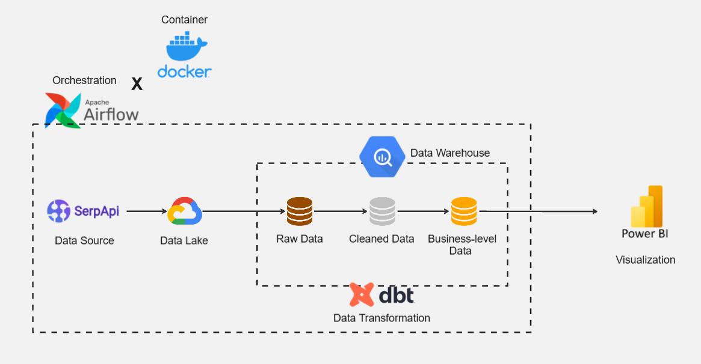

# End-to-End Data Engineering Project: Smartphones Price Monitoring

## Business Case 

In the aggressive smartphone retail market, pricing is a primary battlefield for market share. For stakeholders and marketing strategy teams, staying ahead of competitors requires more than just observation; it demands automated, daily, actionable intelligence. Stakeholders within the pricing and sales teams rely on this pipeline for:

- Optimizing competitive pricing strategies.

- Analyzing market trends and forecasting future movements.

- Replacing manual price checking with a robust automated pipeline, allowing the team to focus on strategy rather than data collection.

### Project Scope

To demonstrate the pipeline's capability in handling high-frequency, real-world market data, the current scope is focused on the Ultra-Flagship segment of the smartphone market. The system tracks the following target products:

- **Apple:** iPhone 17 Pro Max

- **Samsung:** Samsung Galaxy S26 Ultra

- **Xiaomi:** Xiaomi 17 Ultra

- **OPPO:** OPPO Find X9 Pro

- **vivo:** vivo X300 Pro

*All selected models are base storage capacity.

**Data Source:** SerpApi

**Scalability:** The pipeline is architected to be product-agnostic. While currently configured for these 5 flagship models, the system can be easily scaled to track hundreds of different product categories by simply updating the target configuration.

## Pipeline Architecture



### Tech Stacks

- **Docker:** Used for containerizing the entire data pipeline environment, ensuring consistent execution across different platforms and simplifying infrastructure management.

- **Apache Airflow:** The core orchestration engine used to schedule, automate, and monitor the end-to-end workflow, from data ingestion to the final transformation.

- **Google Cloud Storage (GCS):** Acts as the project's Data Lake, providing scalable object storage for landing and archiving raw data files before processing.

- **BigQuery:** A serverless, highly scalable cloud data warehouse used to store structured data and execute complex analytical queries at high speed.

- **dbt (Data Build Tool):** The transformation layer used to clean, model, and prepare data within BigQuery using SQL, implementing the Medallion Architecture (Raw, Staging, and Marts).

- **Power BI:** The visualization platform used to create interactive dashboards, turning processed data into actionable market insights.

### Data Pipeline Flow

- **Extract:** Automated data collection from SerpApi (Data Source) using Python scripts. These tasks are orchestrated by **Apache Airflow** and the extracted data is stored as raw files in **Google Cloud Storage (GCS)**.

- **Load:** Raw data files from GCS are transferred to **BigQuery** raw tables, serving as the landing zone for the data warehouse.

- **Transform:** Data is processed within BigQuery using **dbt**, following the Medallion Architecture to ensure data quality and integrity:

	- **Raw Data (Raw):** The initial ingestion layer where data is kept in its original format to maintain a source of truth.

	- **Cleaned Data (Staging):** Involves data cleaning, type casting, standardized naming conventions, and deduplication to create a reliable foundation.

	- **Business-level Data (Marts):** The final analytical layer where data is joined and aggregated. This includes complex logic, making it ready for **Power BI** visualization.

## Setup Instructions

### 1. Prerequisites

Before you begin, ensure you have the following installed and configured on your local machine:

- **Docker & Docker Compose:** To run the containerized environment.

- **Git:** For version control and cloning the repository.

- **Google Cloud Platform Account:** Required for GCS and BigQuery. Your **Service Account JSON Key** must be assigned the following roles as seen in the configuration:

	- Storage Object Admin

	- BigQuery Job User

	- BigQuery Data Editor

### 2. Clone the repository

First, clone the repository to your local machine to create the project structure:

```Bash
# Clone the repository
git clone https://github.com/chantakornchw-max/End-to-End-Data-Engineering-Project-Smartphones-Price-Monitoring.git

# Enter the project directory
cd End-to-End-Data-Engineering-Project-Smartphones-Price-Monitoring
```
### 3. Local Configuration

Now that you have the project folder, set up local environment:

- **GCP Credentials:** Place your service account JSON key in the `./credentials/` directory (mapped as a volume in Docker)

- **Environment Variables:** Create a `.env` file in the root directory and define `AIRFLOW_UID` to ensure proper container file permissions.

- **dbt Configuration:** dbt requires a `profiles.yml` file to connect to BigQuery. Create a file named profiles.yml inside the `dbt/dbt_transformation/` directory with the following content:

	```YAML
	dbt_transformation:
	outputs:
		dev:
		type: bigquery
		method: service-account
		project: your-gcp-project-id  # Replace with your Project ID
		dataset: de_smartphone_staging
		threads: 1
		keyfile: /opt/airflow/credentials/JSON_key.json # Use the path inside Docker
		location: us-east1 # Or your preferred location
	target: dev
	```

### 4. Start the System

This project uses a custom Dockerfile to install `astronomer-cosmos` and `dbt-bigquery` onto the Airflow base image. To build and start the system, run:

```Bash
# Build custom images and start services in detached mode
docker compose up -d --build
```
### 5. Airflow Connections & Variables Configuration

Once the containers are healthy, access `http://localhost:8080` to finish the setup:

- **Airflow Connections** To enable Airflow to interact with Google Cloud services, you need to set up a connection in the Airflow UI **(Admin > Connections > Add a new record)**:

	- **Connection Id:** `gcp_key_conn`.

	- **Connection Type:** `Google Cloud`.

	- **Keyfile Path:** `/opt/airflow/credentials/JSON_key.json` (This matches the volume mapping in your Docker configuration).

- **Airflow Variables:** Once the Airflow UI is accessible, you must manually add the following variables **(Admin > Variables > Add a new record)**:

	- **API_KEY**

		- **Key:** `serp_api_key`

		- **Val:** Your API key for fetching smartphone price data.

	- **GCP_PROJECT_ID**

		- **Key:** `gcp_project_id`

		- **Val:** Your specific Google Cloud Project ID.

### 6. Running the Pipeline

- **DAG:** Unpause and trigger the DAG to begin the ELT process for the target smartphone models.

- **dbt Transformations:** The pipeline automatically handles transformations. However, you can manually trigger dbt models using:

	```Bash
	docker compose exec airflow-worker dbt run
	```

- **Clean Up:** To stop and remove the containers, use:

	```Bash
	docker compose down
	```

